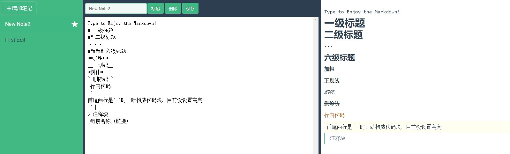

 **已完成：** 
1. 三栏布局：利用flex进行布局，设高度为100vh
2. 完成Mainpane编辑区组件和Preview预览区组件的通信。
   以父组件作为桥梁，利用watch监视编辑内容的变化，从而触发事件，将编辑的内容提交到父组件，父组件在通过props传给预览区组件。
3. 完成标题的识别和解析：
   利用换行符进行正则匹配。通过正则进行识别，因为标题格式与其他格式是相斥的，所以相对简单。    
   存在问题是：`<h1>`和`<h2>`的标题大小一样，或许后续需要利用div来自定义样式。

 **剩余进度：** 

1. [√]行内加粗，当段落内出现多对"**"时，只能识别最外面一层，需要改进（2021.10.2）
2. [√]行内斜体（2021.10.2）
3. [√]行内下划线（2021.10.2）
4. [√]行内删除线（2021.10.2）
5. [√]行内代码：改变字体和颜色（2021.10.2）
6. [√]分割线（2021.10.2）
7. [√]代码块（2021.10.5）
8. [√]注释块（2021.10.5）
9. [√]链接处理（2021.10.5）
10. [√]把HTML标签正常显示（2021.10.5）
11. [√]使编辑位置与预览位置同时出现在可视区域（2021.10.5）
12. [√]为预览区设置滚动条（2021.10.5）
13. [ ]列表
14. [×]~~图片（暂不考虑）~~
15. [×]~~表格（暂不考虑）~~
16. [ ]笔记存储格式：时间，标题，状态（收藏）
17. [ ]笔记保存和删除


**语法**
```
# 一级标题
## 二级标题
···
###### 六级标题
**加粗**
__下划线__
*斜体*
~~删除线~~
`行内代码`
首尾两行是```时，就构成代码块，目前没设置高亮
> 注释块
[链接名称](链接)
```


